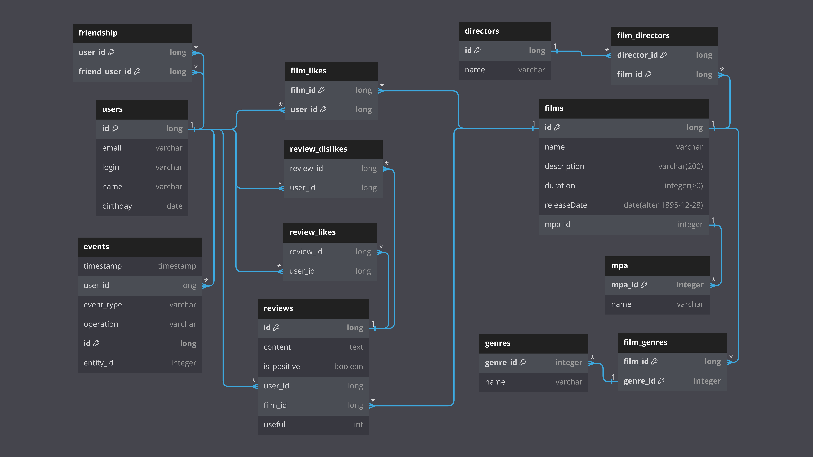

# Filmorate
### Бэкенд приложения для поиска фильмов и сериалов

**Основные объекты взаимодействия:**
<br>• Фильмы, их режиссеры, жанры и рейтинги возрастных ограничений
<br>• Отзывы на фильмы с оценками полезности, лайки фильмов
<br>• Пользователи и лента событий 

## Функционал и команды
**Для управления пользователями доступно:**
<br>• Создать нового пользователя
<br>• Изменить и удалить существующего пользователя
<br>• Получить список всех пользователей или конкретного пользователя по его id
<br>• Добавить и удалить из друзей
<br>• Получить список друзей конкретного пользователя
<br>• Получить список общих друзей пользователей
<br>• Просмотреть ленту новостей на платформе от друзей пользователя: добавление/ удаление из друзей, лайки, отзывы
<br>• Получить рекомендации по фильмам для просмотра

**Для управления фильмами доступно:**
<br>• Добавить новый фильм
<br>• Изменить и удалить существующий фильм
<br>• Получить список всех фильмов или конкретный фильм по id
<br>• Добавить и удалить лайк у конкретного фильма
<br>• Получить список популярных фильмов с фильтрацией по жанру и/или году и с возможностью указания их количества
<br>• Получить список популярных фильмов по ключевым словам в названии и/или режиссеру
<br>• Получить список фильмов выбранного режиссера, отсортированных по количеству лайков или году выпуска
<br>• Получить список общих фильмов с выбранным пользователем, отсортированных по популярности
<br>• Получить список всех жанров фильмов, доступных в сервисе
<br>• Получить список всех возрастных рейтингов фильмов, доступных в сервисе


## Взаимосвязи объектов БД (базы данных)



**Примеры запросов:**

<details>
  <summary>Получить пользователя с id = 5</summary>

```roomsql
SELECT *
FROM users
WHERE id = 5;
```

</details>

<details>
  <summary>Получить список всех друзей пользователя с id = 5 </summary>

```roomsql
SELECT *
FROM users
WHERE id IN 
    (SELECT friend_user_id
    FROM friendship
    WHERE user_id = 5);
```

</details>

<details>
  <summary>Получить фильм с id = 3</summary>

```roomsql
SELECT *
FROM films
WHERE film_id = 3;
```

</details>

<details>
  <summary>Получить ТОП-10 фильмов</summary>

```roomsql
SELECT f.name AS topfilms
FROM films AS f
LEFT JOIN film_likes AS lk ON f.id = lk.film_id
GROUP BY topfilms ORDER BY COUNT(lk.user_id) DESC LIMIT 10;
```

</details>

## Запуск приложения
1. Выполните клонирование репозитория и откройте его в IntelliJ IDEA.
2. Запустите класс `FilmorateApplication` с методом `main`.

## Выполнение тестов
1. Выполните клонирование репозитория и откройте его в IntelliJ IDEA.
2. Запустите тесты в папке `filmorate/src/test/java`.

## Тесты API-запросов
Проверка эндпоинтов выполняется с использованием 
[json-коллекции](src/main/resources/testAPI.json),
которую необходимо импортировать в приложение для тестирования API, например Postman.
Предварительно необходимо запустить приложение в классе `FilmorateApplication`.

